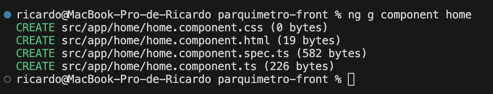

# Primeiros passos

Instalar Node JS (Download pela internet)

Abrir o terminar e verificar se o node foi instalado corretamente

$ node -v

Se estiver tudo ok, instalar o angular com o comando abaixo

$ npm install -g @angular/cli

Abra o projeto no VSCode

Após abrir o projeto, acesse o terminal e rode o comando

$ npm install

Após instalar todas as bibliotecas, suba o projeto usando o comando

$ npm start

# Criar novos Componentes

$ ng g component {NomeDoComponente}

Resultado esperado:

# Framework Visual

Como layout usaremos o angular material
https://material.angular.io/components/categories

# ParquimetroFront

This project was generated with [Angular CLI](https://github.com/angular/angular-cli) version 17.0.7.

## Development server

Run `ng serve` for a dev server. Navigate to `http://localhost:4200/`. The application will automatically reload if you change any of the source files.

## Code scaffolding

Run `ng generate component component-name` to generate a new component. You can also use `ng generate directive|pipe|service|class|guard|interface|enum|module`.

## Build

Run `ng build` to build the project. The build artifacts will be stored in the `dist/` directory.

## Running unit tests

Run `ng test` to execute the unit tests via [Karma](https://karma-runner.github.io).

## Running end-to-end tests

Run `ng e2e` to execute the end-to-end tests via a platform of your choice. To use this command, you need to first add a package that implements end-to-end testing capabilities.

## Further help

To get more help on the Angular CLI use `ng help` or go check out the [Angular CLI Overview and Command Reference](https://angular.io/cli) page.
